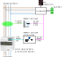
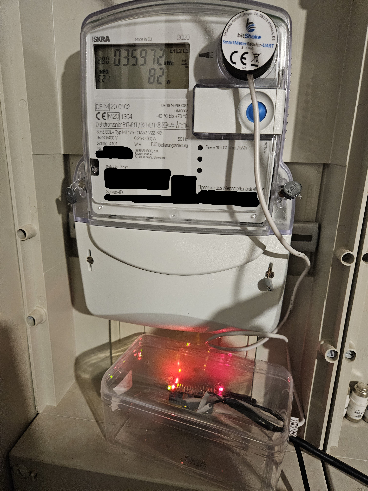

# Motivation
To measure household electricity consumption in a typical photovoltaic or battery system in Germany, an additional power sensor is installed alongside the grid operator's electricity meter. This additional power sensor can be accessed directly by the Hybrid- or Batteryinverter, because a compatible model is installed by the PV installer or electrician.  
Many models use a Modbus RTU (RS-485) interface with a typical update rate of 1 to 4 Hz.

System overview:

This setup has some advantages and disadvantages.  
Disadvantages:
- Device cost of 100–300 € for the extra power sensor
- Installation cost, electrician needed
- Space required in the cabinet
- Power offset between grid operator's electricity meter and extra power sensor, 3–10 Watt
- Power consumption of the device, 0.4–2 Watt
- Minimal voltage/power loss in the main power cable, e.g. due to:
  - Longer cables have to be installed for the measurement setup.
  - A power sensor with an internal current measuring path is installed, as in the [Kaco Hy-switch](https://github.com/Philip-Kiehnle/kaco_blueplanet_hybrid10/tree/main/power_sensor).
  - Clamp current sensors have some loss in their cores.

Advantages:
+ Decent update rate of the power measurement enables fast settling time of the control loop
+ High reliability of the setup because of compatible power meter and inverter
 (Both arguments may be neglected in the future, see section [Impact on system performance](#impact-on-system-performance))

-> Let's take a different approach and use the "already there" optical infrared interface from the grid operator's energy/power meter and develop a protocol conversion adapter that behaves like a compatible power sensor.

# STM32 Microcontroller used as an Emulator for Chint Smart Power Sensor

The first prototype uses an optical read head, a microcontroller, and an RS-485 transceiver.

The optical read head is magnetically attached to the optical interface of the electricity meter. These readers are available online in several versions. Some include a WiFi module such as an ESP32, but for this project the bare UART output model is used. The read head converts the optical UART to an electrical UART signal. The UART signal is connected to the microcontroller, which decodes the Smart Message Language (SML) frames, sent by the electricity meter.  
Three elements are decoded:  

| OBIS code | Description                    | Variable name in software |
| --------- | ------------------------------ | ------------------------- |
| 16.7.0    | Sum active instantaneous power | power                     |
| 1.8.0     | Positive active energy total   | energy_import             |
| 2.8.0     | Negative active energy total   | energy_export             |

The STM32l432kc Nano devboard from ST Microelectronics was used. Its STM32L432KCU3 microcontroller runs at 32 MHz. The microcontroller implements a Modbus slave using the same registers as the original Chint power sensor. An RS-485 transceiver connects the microcontroller and the inverter (Huawei SUN2000-10KTL).

A breadboard was soldered to add connectors and the RS-485 transceiver.  
The prototype requires the following connections:
| Connector          | Description                                |
| ------------------ | ------------------------------------------ |
| USB-Power          | 5 V supply, e.g. from a 230 V power supply |
| Infrared Read Head | 4 pins for the infrared adapter: VCC, GND, TX, RX. TX can be used in future software version to (re-)enter the meter key in case of a reset during a power outage. The manual [key input procedure](https://youtu.be/aqHauk3bNFA) can be avoided. |
| RS-485              | 2 pins for connection to the inverter     |

The prototype uses the following LED states:  
Yellow LED toggles with every decoded SML message of the Smart Meter.  
Green LED toggles on activity on the RS-485 bus.  
Both LEDs toggle fast at 10 Hz when an error handler is called. A microcontroller reboot is triggered automatically after 60 seconds. 

The setup looks like this:

## Power Consumption
The device is powered from the 230 V grid using an USB power supply.  
The power consumption was measured using the ELV Energy Master power meter:  
5 V 500 mA power supply: 0.4-0.5 W  
Reference test: 5 V 2 A Samsung power supply: 0.4 W

## Cost
STM devboard 18 €  
IR Smart Meter Reader (bitshake UART) 24 €  
RS-485 IC 1 €  
-> 43 €  
-> In a redesigned solution, everything should fit in the infrared reader magnet head.  

## ToDo
Every ~3 month, the prototype needs a power reset, because the Huawei monitoring  shows an error.  
-> Log the communication frames during this situation.

The use of a Huawei battery is untested. If the inverter control loop does not expect the increased delay time of the power measurement, instabilities may occur. In this case, a dead-time compensation (DTC) such as a Smith predictor must be implemented in the power sensor emulator software.

# Chint Smart Power Sensor DTSU666-H

To find the register list of the original Chint Power Sensor, this repo was helpful:
https://github.com/lmatula/ha_chint_pm

## Power Consumption
Single phase connected, all current sensors connected. The power consumption was measured using the ELV Energy Master power meter:  
Display Backlight ON : 0.6 W / 0.6 VA  
Display Backlight OFF: 0.45 W / 0.45 VA

According to datasheet:
Voltage: < 1 W (per phase)  
Current: < 1 VA (per phase) < 20 mA (per phase)

According to Huawei online manual:  
Power consumption of voltage: ≤ 1.5 W / 6 VA  
Power consumption of current: Ib < 10 A : ≤ 0.2 VA   Ib ≥ 10 A :≤ 0.4 VA

### Findings
Data update rate of the Chint Power Sensor?  
-> Registers change with a rate of about 13.6 Hz.

Modbus read interval of the Huawei inverter?  
-> According to Modbus log between 3 and 4 Hz.

Is an exact voltage measurement necessary for the inverter to detect the correct installation of the Chint Power Sensor?  
-> Don't think so, because the original Chint sensor will be detected even if only one phase is connected.

# Data Comparison

Python Modbus register read, with a single phase connected to Chint Power Sensor:

| Key        | Chint Power Sensor           | STM32 Power Sensor Emulator |
|------------|------------------------------|-----------------------------|
| addr       | 3                            | 3                           |
| baud       | 11                           | 11                          |
| clre       | 0                            | 0                           |
| day        | 0                            | 1                           |
| dmpt       | 0.0                          | 0.0                         |
| expep      | 0.0                          | 0.0                         |
| freq       | 50.0                         | 50.0                        |
| hour       | 0                            | 1                           |
| ia         | 0.003000000026077032         | 0.0                         |
| ib         | 0.008999999612569809         | 0.0                         |
| ic         | 0.00800000037997961          | 0.0                         |
| impep      | 0.0                          | 0.0                         |
| irat       | 1                            | 1                           |
| meter_type | 1                            | 1                           |
| minutes    | 17                           | 1                           |
| month      | 0                            | 4                           |
| net        | 0                            | 0                           |
| pa         | 0.10000000149011612          | 0.0                         |
| pb         | 0.0                          | 0.0                         |
| pc         | 0.0                          | 0.0                         |
| pfa        | 1.0                          | 1.0                         |
| pfb        | 1.0                          | 1.0                         |
| pfc        | 1.0                          | 1.0                         |
| pft        | 1.0                          | 1.0                         |
| protocol   | 3                            | 3                           |
| pt         | 0.10000000149011612          | 0.0                         |
| q1eq       | 0.0                          | 0.0                         |
| q2eq       | 0.0                          | 0.0                         |
| q3eq       | 0.0                          | 0.0                         |
| q4eq       | 0.0                          | 0.0                         |
| qa         | 0.10000000149011612          | 0.0                         |
| qb         | 0.0                          | 0.0                         |
| qc         | 0.0                          | 0.0                         |
| qt         | 0.10000000149011612          | 0.0                         |
| rev        | 109                          | 109                         |
| secound    | 32                           | 1                           |
| ua         | 226.39999389648438           | 230.0                       |
| uab        | 226.6999969482422            | 400.0                       |
| ub         | 0.699999988079071            | 230.0                       |
| ubc        | 0.699999988079071            | 400.0                       |
| uc         | 0.0                          | 230.0                       |
| uca        | 226.39999389648438           | 400.0                       |
| ucode      | 701                          | 701                         |
| urat       | 10                           | 10                          |
| year       | 0                            | 2024                        |

# Ideas

## Power Supply Solutions
The 230 V AC power supply is impractical if there is no socket nearby.

### Inverter USB Port
The Huawei SUN2000-12KTL-M5 has a USB voltage of 5.01V, but the USB port is typically used by the WLAN dongle.  
USB GND is connected to data connector GND (~0,8Ohm).

### Energy Harvester for RS-485 Bus
Use 1.8 V or 3.3 V microcontroller supply voltage. 1.8 V is too low for RS-485 within spec.  
STM32: 84uA/MHz in run mode. On average, 1 MHz should be sufficient:  
$` 84\,\mathrm{\mu A} \cdot 1.8\,\mathrm{V} = 151\,\mathrm{\mu W} `$

Use a push-pull microcontroller pin as a half bridge of a boost converter and boost the available voltage/power during TX of the Huawei inverter to 3.3 V bus.  
As a backup, use 2 x 1.5 V Alkaline batteries or a Li-Ion cell.  
Does Huawei inverter use a 120 Ohm termination resistor?  
In this case, the RS-485 transceiver IC will probably consume too much energy during the transmission of the data registers to the inverter.

Test of available RS-485 bus power of a Huawei SUN2000-12KTL-M5:

RS-485 pins have 2.554 V and 2.084 V to GND.

Connected 470 Ohm from RS-485 pin to GND:  
0.147V -> 0.31mA; 0.046mW  
0.12V -> 0.26mA; 0.03mW  
-> no harvesting seems possible if the transceiver is inactive.  
Or Impedance matching is necessary:  
(2.554V-0.147V)/0.31mA=7.76kOhm  
-> ((2.554V/2)^2)/(7.76k/2)=0.42mW

Energyharvesting during TX of the inverter:  
Duration of bus activity?

# Impact on System Performance
The grid operator's electricity meter may not send the current power via its optical interface per default. A pin code from the grid operator has to be entered via the optical interface with a torch, so the meter sends the actual power every second (1 Hz). The extra meter has a typical update rate of 1 to 4 Hz, but devices with higher update rates are available (e.g. [Kaco Hy-switch](https://github.com/Philip-Kiehnle/kaco_blueplanet_hybrid10/tree/main/power_sensor)).

The ISKRA MT175 and MT631 electricity meters store energy consumption in 0.1 Wh increments. This equals a consumption of 360 Watt for 1 second. A hint for this step size is the printed marking "10000 imp/kWh" on the meter housing.  
For larger load steps, the electricity meter counts the mismatch between battery inverter power and consumption.

Let's compare the system behavior using the grid operator's electricity meter as a power sensor versus a dedicated power sensor.  
Assumptions:
1. Dedicated power sensor and inverter control loop are super-fast and no mismatch due to load steps occurs.
2. Dedicated power sensor has a power consumption of 1 W.
3. Dedicated power sensor has 5 W offset.
4. Power loss in the current sensor cores is neglected.
5. Power sensor emulator has a power consumption of 0.4 W
6. During cooking with a glass ceramic hob at a medium power level, 2 kW load steps occur with a period of 5 sec on 5 sec off. This power level is used for 30 minutes every day. In 50% of the cooking sessions, the PV input is so high that there is no mismatch.
7. The inverter power matches the load 2 sec after the load step occurs.
8. Electricity price is 0.3 € per kWh.
9. Cost of feed-in from battery: 0.15 €. (When mismatch causes feed-in, battery power is fed to grid for feed-in tariff. But must be purchased again, when battery gets empty.)
10. Feed-in tariff: 0.08 €
11. In 50% of the 24/7 self-consumption, PV power feed-in is available.

**Dedicated Power Sensor**  
In one year, the dedicated power sensor self-consumption causes:  
$`8760\,\mathrm{h} \cdot (5\,\mathrm{W} + 1\,\mathrm{W}) = 52.6\,\mathrm{kWh}`$  
grid consumption and no extra feed-in from the battery.

**Power Sensor Emulator (Smart Meter Adapter)**  
In one year, the power sensor emulator causes:  
$`8760\,\mathrm{h} \cdot 0.4\,\mathrm{W} = 3.5\,\mathrm{kWh}`$  
grid consumption.  
Using the grid operator's electricity meter, the system causes mismatch only when the glass ceramic hob is used. The mismatch during a cooking session using the medium power level causes the grid consumption / feed-in scheme:
- **2 sec × 2 kW** grid **consumption**  
- **3 sec × 0 kW** grid **consumption**  
- **2 sec × 2 kW** grid **feed-in**  
- **3 sec × 0 kW** grid **feed-in**

This situation occurs for $`50\% \cdot 30\,\mathrm{min} = 0.25\,\mathrm{h}
`$  
So the energy impact is: $`
\left( \frac{2\,\mathrm{s}}{10\,\mathrm{s}} \cdot 0.25\,\mathrm{h} \right) \cdot 2\,\mathrm{kW} = 0.1\,\mathrm{kWh}`$
grid consumption and the same amount of grid feed-in.  
Annually, this sums up to:  
$`365 \cdot 0.1\,\mathrm{kWh} = 36.5\,\mathrm{kWh}`$

**Economical Perspective**  
<ins>Initial cost:</ins>  
Cost of extra power sensor: 100 € + 150 € installation  
Cost of power sensor emulator: 50 € + self-installation (no electrician needed)

<ins>Runtime cost in 15 years:</ins>  
Dedicated power sensor:  
$` 15\,\mathrm{years} \cdot 52.56\,\mathrm{kWh} \cdot (0.3\,\text{€/kWh} + 0.08\,\text{€/kWh})/2 = 149.8\,€`$  
Power sensor emulator:  
$` \begin{aligned} 15\,\mathrm{years} \cdot & ( 3.5\,\mathrm{kWh} \cdot (0.3\,\text{€/kWh} + 0.08\,\text{€/kWh})/2\\ & + 36.5\,\mathrm{kWh} \cdot (0.3\,\text{€/kWh} + 0.15\,\text{€/kWh})) = 256.35\,€ \end{aligned}`$

<ins>Overall Cost:</ins>  
Dedicated power sensor: 250 € + 149.8 € = **399.8 €**  
Emulator: 50 € + 256.35 € = **306.35 €**

**Outlook**
- A predictive controller can improve the mismatch, by learning the behavior of the glass ceramic hob and the user.
- A custom inverter with direct input of SML data without a protocol translator can improve the loop settling time to e.g. 1.1 sec instead of 2 sec. A GaN-based [PV battery inverter](https://github.com/Philip-Kiehnle/PVBatteryInverter) using this feature is under development.
- The grid operator's electricity meter should not count in tiny 0.1 Wh steps (increments). A step size to compensate a 3.6 kW load within 10 seconds should be suitable. This corresponds to 10 Wh increments.

# Background Story
The project was triggered by a friend with a Huawei SUN2000-10KTL inverter, who wanted to buy a Huawei Luna battery. After some research, I found that the Huawei battery is not a typical high voltage battery. It consists of stackable 48 V battery modules with an internal DCDC converter. However, the module voltage does not add up as usual because the modules are connected in parallel. The top stack contains another DCDC converter, and I had my doubts about its efficiency, especially at low loads, which occur overnight. [Application Note: Energy Efficiency of Smart String Energy Storage
System LUNA2000](https://www.photovoltaikforum.com/core/attachment/426947-application-note-luna2000-efficiency-pdf/)  
In order to check the household's electricity consumption at night, we wanted to log the data. The PV installer sold the power meter for the system some years ago, but did not install it. So the original Chint power sensor can be used for protocol reverse engineering and to develop the protocol adapter.
